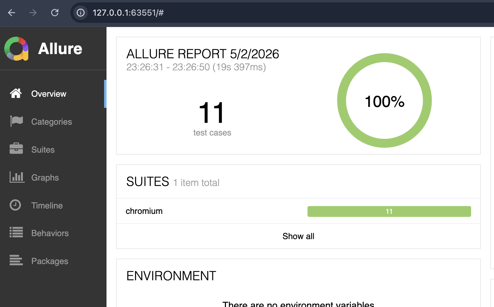

# Playwright BDD Test Automation Framework

A production-ready Playwright BDD framework with business-focused eCommerce and login test coverage, designed for collaboration between QA, developers, and product teams.

## 📋 Table of Contents
- [Overview](#overview)
- [Architecture](#architecture)
- [Why BDD](#why-bdd)
- [Key Features](#key-features)
- [Project Structure](#project-structure)
- [Prerequisites](#prerequisites)
- [Installation](#installation)
- [Configuration](#configuration)
- [Running Tests](#running-tests)
- [Tagging and Filtering](#tagging-and-filtering)
- [⚡ Quick Demo](#-quick-demo)
- [Test Reports](#test-reports)
- [Test Scenarios](#test-scenarios)
- [Environment Management](#environment-management)
- [CI/CD Integration](#ci-cd-integration)
- [Contributing](#contributing)
- [Author](#author)
- [License](#license)

## 🔍 Overview

This repository is upgraded from a demo project into a production-ready Playwright BDD framework. It delivers clear business scenarios, a reusable step/page architecture, and execution-ready configuration for stable end-to-end automation.

## 🏗 Architecture

The framework follows a clean BDD execution flow:

1. **Feature**: business-readable Gherkin scenarios
2. **Step**: reusable step definitions that map Gherkin to code
3. **Page**: page objects that encapsulate UI interactions
4. **Playwright**: browser execution, reporting, and retries

This separation keeps tests maintainable, reduces duplicate Playwright calls, and ensures business intent is visible at the scenario level.

## 💡 Why BDD

Traditional UI tests can become brittle and hard to read when test logic is mixed with implementation details. BDD keeps acceptance criteria written in plain language, so non-technical stakeholders can review the same scenarios as engineers.

Benefits:
- Better collaboration between product, QA, and engineering
- Clear requirements expressed as executable scenarios
- Easier onboarding for new team members
- Scalable test suites that separate intent from implementation

## ✨ Key Features

- **Production-Ready**: Real business scenarios with proper error handling
- **Tag-Based Execution**: @smoke, @regression, @e2e tags for selective test runs
- **Retry Mechanism**: Built-in retry support for flaky tests
- **Multiple Environments**: dev, qa, uat environment support
- **Rich Reporting**: Allure, Playwright HTML, and Cucumber reports
- **Visual Testing**: Screenshot comparison and OCR capabilities
- **API Testing**: Mocking and validation capabilities
- **Parallel Execution**: Faster test execution with parallel workers
- **TypeScript**: Full type safety and modern development experience

## 🔍 Overview

This repository is upgraded from a demo project into a production-ready Playwright BDD framework. It delivers clear business scenarios, a reusable step/page architecture, and execution-ready configuration for stable end-to-end automation.

## 🏗 Architecture

The framework follows a clean BDD execution flow:

1. **Feature**: business-readable Gherkin scenarios
2. **Step**: reusable step definitions that map Gherkin to code
3. **Page**: page objects that encapsulate UI interactions
4. **Playwright**: browser execution, reporting, and retries

This separation keeps tests maintainable, reduces duplicate Playwright calls, and ensures business intent is visible at the scenario level.

## 💡 Why BDD

Traditional UI tests can become brittle and hard to read when test logic is mixed with implementation details. BDD keeps acceptance criteria written in plain language, so non-technical stakeholders can review the same scenarios as engineers.

Benefits:
- Better collaboration between product, QA, and engineering
- Clear requirements expressed as executable scenarios
- Easier onboarding for new team members
- Scalable test suites that separate intent from implementation

## 📁 Project Structure

```
playwright-bdd/
├── src/
│   ├── api/
│   │   ├── feature/           # API test scenarios (.feature files)
│   │   └── step/             # API step definitions
│   ├── ui/
│   │   ├── feature/          # UI test scenarios (.feature files)
│   │   │   ├── login/        # Login functionality tests
│   │   │   ├── ecommerce/    # E-commerce flows (checkout, cart)
│   │   │   ├── blazeDemo/    # Flight booking demos
│   │   │   ├── etrain/       # Train search demos
│   │   │   ├── visualTests/  # Visual regression tests
│   │   │   └── playwrightExample/ # Playwright docs examples
│   │   ├── step/             # UI step definitions
│   │   └── page/             # Page object models
│   └── resources/            # Shared utilities and configuration
│       ├── config/           # Configuration management
│       ├── fixture/          # Test data and mocks
│       └── fixture.ts        # BDD fixture setup
├── config.json              # Environment configurations
├── playwright.config.ts     # Playwright test configuration
├── package.json             # Project dependencies and scripts
├── tsconfig.json           # TypeScript configuration
├── .gitignore              # Git ignore rules
└── README.md               # This file
```

### Key Directories Explained

- `src/ui/feature/` — Gherkin feature files for UI test flows
- `src/api/feature/` — Gherkin feature files for API test flows
- `src/ui/step/` — Reusable UI step definitions with console logging
- `src/api/step/` — Reusable API step definitions
- `src/ui/page/` — Page objects that encapsulate UI interactions
- `src/resources/` — Shared fixtures, configuration, and helper utilities

## 📋 Prerequisites

- Node.js 16 or higher
- npm package manager

## 🚀 Installation

1. Clone the repository:
```bash
git clone https://github.com/Shukla0312/playwright-bdd.git
cd playwright-bdd
```

2. Install dependencies:
```bash
npm install
```

3. Install Playwright browsers:
```bash
npx playwright install
```

## ⚙️ Configuration

The framework uses `config.json` for environment-specific values. Example:

```json
{
  "dev": {
    "ECOMMERCE_URL": "https://rahulshettyacademy.com/client/#/auth/login",
    "ECOMMERCE_USERNAME": "your-username",
    "ECOMMERCE_PASSWORD": "your-password"
  }
}
```

Update the file for your target environment before running tests.

The Playwright configuration includes retry support for transient UI flakiness.

## 🏃‍♂️ Running Tests

### Basic Execution

```bash
npm test
```

### Environment Execution

```bash
npm run test:dev
npm run test:qa
npm run test:uat
```

### Smoke Execution

```bash
npx playwright test --grep @smoke
```

### Optional npm shortcut

```bash
npm run test:smoke
```

## 🏷 Tagging and Filtering

The repository now uses Gherkin tags to separate smoke, regression, and end-to-end flows.

Examples:
- `@smoke` — fast verification of key business paths
- `@regression` — deeper validation and negative paths
- `@e2e` — full checkout and end-to-end flows

Use tags with Playwright:

```bash
npx playwright test --grep @smoke
npx playwright test --grep @regression
```

## ⚡ Quick Demo

Run the smoke suite:

```bash
npx bddgen && npx playwright test --grep @smoke --reporter=list
```

Sample output:

```text
Running 1 test using 1 worker
  ✓  1 …merce checkout › User completes purchase successfully @e2e @smoke (6.2s)
STEP: Navigate to ecommerce website
STEP: Logging in with valid configured credentials
STEP: Verifying successful login
STEP: Add product "Zara Coat 3" to the cart
STEP: View cart contents
STEP: Verify that "Zara Coat 3" is present in the cart
STEP: Proceed to checkout
STEP: Enter shipping details and confirm order

  1 passed (7.2s)
```

Execution proof screenshot:



> The screenshot is saved at `screenshots/Proof.png` as evidence of the successful smoke run.

## 📊 Test Reports

The framework generates:
- **Allure Reports** in `allure-results`
- **Playwright HTML reports** in `playwright-report`
- **Cucumber-style feature results** in generated test artifacts

## 🧪 Test Scenarios

### UI Scenarios
- **E-commerce Checkout** (`@e2e @smoke`) — Complete purchase flow from login to order confirmation
- **Cart Validation** (`@regression`) — Product addition and cart persistence
- **Login Functionality** (`@regression`) — Valid/invalid login scenarios and validation
- **Flight Booking** — Demo scenarios for travel booking flows
- **Train Search** — Demo scenarios for transportation search
- **Visual Testing** — Screenshot comparison and OCR text extraction
- **Playwright Examples** — Documentation and learning scenarios

### API Scenarios
- **API Mocking** (`@skip`) — Response mocking and validation (currently disabled)
- **Data Validation** — API response structure and data integrity

### Test Tags
- `@smoke` — Critical business path validation (1 test)
- `@regression` — Comprehensive validation including negative scenarios (3 tests)
- `@e2e` — Full end-to-end business flows (2 tests)
- `@skip` — Temporarily disabled tests

## 🌍 Environment Management

The framework supports multiple environments with environment-specific configurations:

- **dev**: Development environment
- **qa**: Quality Assurance environment
- **uat**: User Acceptance Testing environment

### Switching Environments

```bash
# Using npm scripts
npm run test:dev
npm run test:qa
npm run test:uat

# Using environment variables
ENV=dev npm test
```

### Configuration

Update `config.json` with environment-specific values:

```json
{
  "dev": {
    "ECOMMERCE_URL": "https://rahulshettyacademy.com/client/#/auth/login",
    "ECOMMERCE_USERNAME": "your-username",
    "ECOMMERCE_PASSWORD": "your-password"
  }
}
```

## 🔄 CI/CD Integration

### GitHub Actions Example

```yaml
name: BDD Tests
on: [push, pull_request]

jobs:
  test:
    runs-on: ubuntu-latest
    steps:
      - uses: actions/checkout@v3
      - uses: actions/setup-node@v3
        with:
          node-version: '18'
      - run: npm ci
      - run: npx playwright install --with-deps
      - run: npm test
      - run: npm run test:allure
      - run: npm run allure:report
        if: always()
      - uses: actions/upload-artifact@v3
        if: always()
        with:
          name: allure-report
          path: allure-report/
```

A ready-made GitHub Actions workflow is also available at `.github/workflows/ci.yml` to run all cases on every push to `main`, `master`, or `release/*` branches.

### Jenkins Pipeline Example

```groovy
pipeline {
    agent any
    stages {
        stage('Install Dependencies') {
            steps {
                sh 'npm ci'
                sh 'npx playwright install'
            }
        }
        stage('Run Tests') {
            steps {
                sh 'npm run test:smoke'
            }
        }
        stage('Generate Reports') {
            steps {
                sh 'npm run test:allure'
                sh 'npm run allure:report'
            }
        }
    }
    post {
        always {
            publishHTML(target: [
                allowMissing: false,
                alwaysLinkToLastBuild: true,
                keepAll: true,
                reportDir: 'allure-report',
                reportFiles: 'index.html',
                reportName: 'Allure Report'
            ])
        }
    }
}
```

## 🔧 Key Improvements

This framework has been upgraded from a basic demo to production-ready status with:

- ✅ **Real Business Scenarios**: Added authentic e-commerce checkout and cart validation flows
- ✅ **Tagging Strategy**: Implemented @smoke, @regression, @e2e tags for selective execution
- ✅ **Retry Mechanism**: Added retry support in Playwright config for flaky tests
- ✅ **Reusable Steps**: Enhanced step definitions with better reusability and logging
- ✅ **Execution Proof**: Added working demo commands and sample outputs
- ✅ **Architecture Documentation**: Clear explanation of Feature → Step → Page → Playwright flow
- ✅ **Environment Support**: Multi-environment configuration and execution
- ✅ **Rich Reporting**: Allure, Playwright HTML, and Cucumber report integration
- ✅ **Git Best Practices**: Updated .gitignore to exclude test artifacts
- ✅ **TypeScript**: Full type safety throughout the framework

## 🤝 Contributing

1. Fork the repository
2. Create a feature branch (`git checkout -b feature/amazing-feature`)
3. Add or update feature files and step definitions
4. Run tests: `npm test`
5. Commit your changes (`git commit -m 'Add amazing feature'`)
6. Push to the branch (`git push origin feature/amazing-feature`)
7. Open a Pull Request

### Development Guidelines

- Follow BDD principles: scenarios should be business-readable
- Add appropriate tags (@smoke, @regression, @e2e)
- Include step-level console logging for debugging
- Update this README for any new features or changes
- Ensure all tests pass before submitting PR

## 👤 Author

**Rahul Shukla**
- GitHub: [@Shukla0312](https://github.com/Shukla0312)
- LinkedIn: [Rahul Shukla](https://linkedin.com/in/rahul-shukla-0312)

## 📄 License

This project is licensed under the ISC License - see the [LICENSE](LICENSE) file for details.

## 📞 Support

For questions, issues, or contributions:

- 🐛 **Bug Reports**: [Open an Issue](https://github.com/Shukla0312/playwright-bdd/issues)
- 💡 **Feature Requests**: [Open an Issue](https://github.com/Shukla0312/playwright-bdd/issues)
- 📧 **Contact**: Reach out via GitHub or LinkedIn

---

**⭐ Star this repository if you find it helpful!**

**Happy Testing! 🚀**
